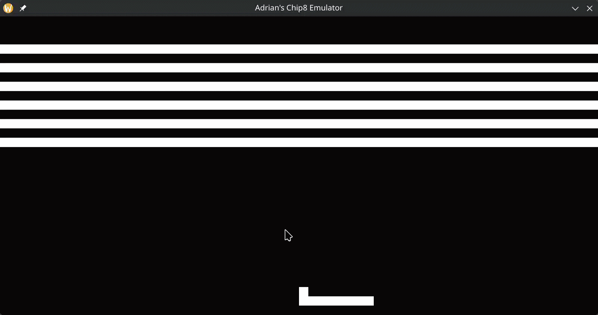
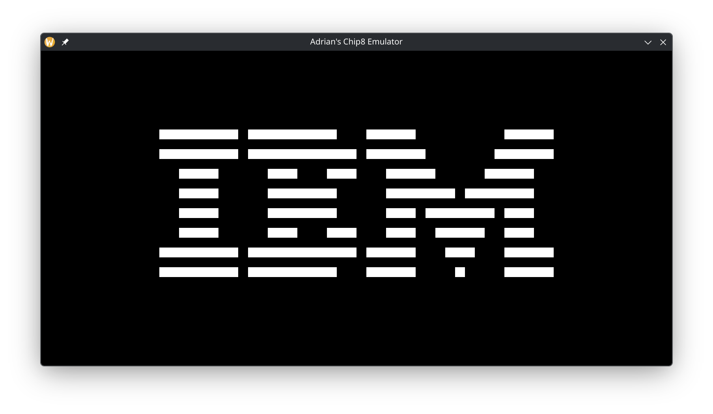
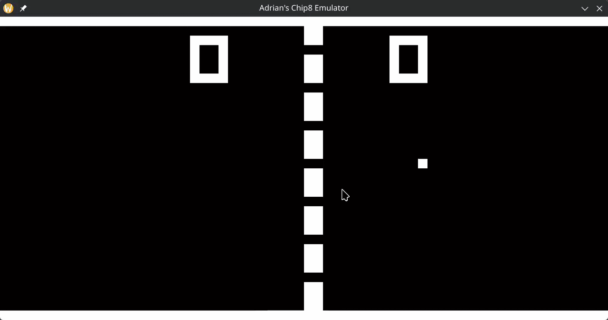

# chip8-emulator

## Summary
An implementation of a CHIP-8 emulator/interpreter written in C and using SDL2 for graphics and sound. This CHIP8 emulator follows the behaviour suggested in [Langhoff's Guide to making a CHIP-8 emulator](https://tobiasvl.github.io/blog/write-a-chip-8-emulator/) largely targetting that of the original COSMAC VIP interpreter but with configurable "quirk" behaviour where needed. This project is not complete yet nor perfect and more features will be documented as they are implemented.

Here are some gifs and pictures of my emulator in action with a selection of ROMs that I found on the internet. (**The flickering when sprites move happens due to how CHIP-8 draws sprites to the screen**)


    

    ### Prerequisites:
    - This project has not been tested on all platforms. Presumes a UNIX-like environment.
- Requires GNU Make.
- Requires GCC.
- Requires SDL2.

### Instructions to Build:
```bash
$ git clone https://github.com/sertralinefeverdream/chip8-emulator.git
$ cd chip8-emulator
$ make
$ cd build
```

### Usage:
```bash
$ ./chip8-emulator <FILE PATH TO ROM> <FLAGS>
```

## Flags/Options

### Config Flags
| Flag | Description | Default Value | Minimum Value|
|------|-------------|---------------|--------------|
|`-w <WINDOW WIDTH>`| Set the window width | `1600` | `64` | 
| `-h <WINDOW HEIGHT>` | Set the window height | `800` | `32` | 
| `--fps <FRAMERATE>` | Set the framerate | `60` | `1` |
| `--ips <INSTRUCTION RATE>` | Set the rate of instructions per second | `700` | `1` |
| `-t <TIMER DECREASE RATE>` | Set the rate that the timer registers decrease per second | `60` | `1` |

### Quirk Flags
| Flag | Instructions Affected | Behaviour when enabled | 
|------|-----------------------|-------------|
| `--q-arith-instr-overflow-reset` | `LD_V_V`, `OR_V_V`, `AND_V_V`, `XOR_V_V` | Arithmetic instructions that do not set a meaningful value in VF will set VF = 0. Behaviour seen in the COSMAC VIP interpreter.
| `--q-shift-only-vx` | `SHR_V_V`, `SHL_V_V` | Bitshift instructions would first copy the value of VY into VX before performing the operation on VX. This quirk is seen in the COSMAC VIP interpreter. The CHIP-48 and SUPER-CHIP specifications bitshift VX in place with no copying of VY.|
| `--q-add-to-index-overflow` | `ADD_I_V` |If the updated index register value is an address outside of the normal addressing range, VF is set to 1. This quirk is seen in the CHIP-8 interpreter for the Amiga.|
| `--q-store-load-increment-index` | `LD_I_V`, `LD_V_I` | Quirk seen in the COSMIC VIP interpreter. Storing to and loading registers from memory would increment the index register value, setting the value of `I` to `I + X + 1` by the end of the operation. Modern interpreters use a temporary variable instead of actually incrementing the index register.|

For example,
```bash
$ ./chip8-emulator MyRom.ch8 --q-arith-instr-overflow-reset --q-shift-only-vx --q-store-load-increment-index
```
May more accurately simulate the behaviour of the original COSMAC VIP CHIP-8 interpreter and may be useful for compatibility with original ROMs.

## Acknowledgements
Special thanks to the following people for their freely-available resources.
- [Cowgod's Chip-8 Technical Reference v1.0](http://devernay.free.fr/hacks/chip8/C8TECH10.HTM)
- [Tobias V. I Langhoff's Guide to making a CHIP-8 emulator](https://tobiasvl.github.io/blog/write-a-chip-8-emulator/)
- [Timendus - chip8-test-suite](https://github.com/Timendus/chip8-test-suite) 
- [kripod - chip8-roms](https://github.com/kripod/chip8-roms) <- Cool ROMS to try out with my emulator.

## License
This project is licensed under the MIT License - see the [LICENSE](LICENSE) file for details.